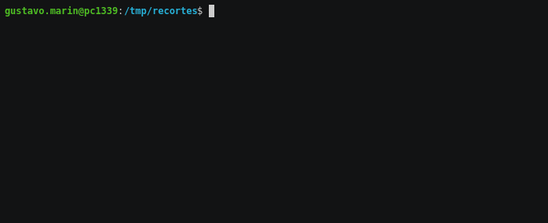

[](https://github.com/guumaster/multi-wget/releases)
[](https://goreportcard.com/report/github.com/guumaster/multi-wget)
[](https://github.com/guumaster/multi-wget/LICENSE)

# Multi wget

A simple CLI to download multiple files with wget. It can be stopped and resume thanks to `wget` feature to continue downloads.


## Why?

If you need to download multiple files and don't want to remember all the `wget` options.


## Installation

Go to the [release page](https://github.com/guumaster/multi-wget/releases) and download the binary you need.

**WARNING**: You need to have `wget` already installed on your system.
 If you are on windows make sure you install it with the setup package listed on [the official wget page](http://gnuwin32.sourceforge.net/packages/wget.htm)


## Usage

Just run it with all the urls you want to download:

```
multi-wget  http://download.url/file1  http://another.download.url/file2
```


### Example




### References

Go Dependencies:
  * [spf13/cobra](https://github.com/spf13/cobra)
  * [urfave/cli](https://github.com/urfave/cli)
  * [vbauerster/mpb](https://github.com/vbauerster/mpb)


### LICENSE
 [MIT license](LICENSE)


### Author(s)
* [guumaster](https://github.com/guumaster)
